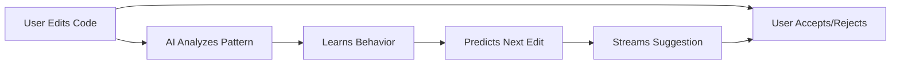
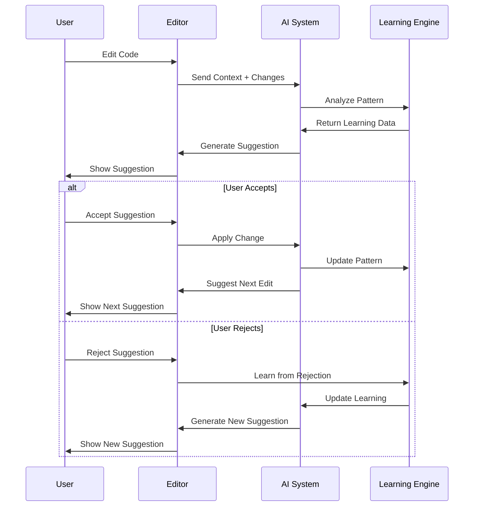

# Next Edit Suggestion (NES)

> **NES is a concept that uses LLM for coding assistance.** Some companies are adopting this approach to make their coding assistants more intelligent. Instead of just completing what you're typing, the LLM learns from your editing patterns and predicts what you'll want to change next in your coding workflow. _For example, if you start adding JSDoc comments to one function, it will suggest adding them to similar functions._

## 🧠 What is NES Concept?

**Next Edit Suggestion (NES)** is a methodology that transforms how AI coding assistants work:

### **🔄 Traditional AI Coding:**

- Completes what you're currently typing
- Suggests based on syntax and context
- Static, reactive approach

### **🚀 NES Approach:**

- **Adapts and learns your editing behavior patterns**
- **Predicts the next logical edit** you'll want to make based on sequential lines
- **Streams suggestions in real-time** using custom unified diff format for fast response
- **Understands your coding workflow** and anticipates next steps

---

## 📝 Understanding Unified Diff Format

**Unified Diff Format** is a standardized way to show changes between two versions of a file, commonly used in version control systems like Git. Before diving into NES, you need to understand how unified diff works:

### **📄 Standard Unified Diff Format:**

```diff
--- a/example.txt
+++ b/example.txt
@@ -1,5 +1,5 @@
This is a line of text.
-This line was changed.
+This line is now different.
Another line of text.
Yet another line.
The final line.
```

**⚙️ How it works:**

- `--- a/file` and `+++ b/file` - File headers showing original and modified files
- `@@ -1,5 +1,5 @@` - **Hunk header**: A "hunk" is a section of changes in a diff file that shows what was modified. `-1,5` means "starting at line 1, 5 lines from original", `+1,5` means "starting at line 1, 5 lines in new file"
- `-` lines - Content removed from original
- `+` lines - Content added to new file
- ` ` (space) - Unchanged lines

### **🔧 Custom Unified Diff Format:**

```diff
@@ a/example.txt:2
-This line was changed
+This line is now different
```

**🔍 Key Differences:**

- **No file headers** - No `--- a/file` or `+++ b/file` lines
- **Direct line targeting** - `@@ filepath:lineNumber` format
- **Sequential hunks** - Each hunk targets specific line numbers
- **Streaming optimized** - **Streaming** means sending data continuously as it's generated, rather than waiting for complete results. Designed for real-time delivery

---

## 🔄 How Algorithm Works

### **🎯 Step 1: Pattern Learning**

The environment sends context to the **LLM (Large Language Model)** by analyzing what should be edited. That's why you should provide rich context as reference. You don't need the entire codebase - simple but powerful context like a **Repo Map** (a structured overview of your codebase's architecture and file relationships) works well. I have already implemented a Repo Map solution here: [AI-Indexing](https://github.com/NeaByteLab/AI-Indexing)

> **💡 Environment Flexibility:** This implementation can be integrated into any development environment - CLI tools, code editors (VS Code, IntelliJ), browser extensions, or custom applications.

**📝 Example - Original File:**

```txt
Hello World

Hello World

Hello World
```

**✏️ User Modifies To:**

```txt
OK World
Hello OK

Hello TEST
Hello OK

OK World
Hello OK
```

**🔗 Sequential Hunk Generation**

The unified diff format breaks changes into sequential hunks with accurate line numbering. This enables:

- **Instant streaming** - LLM responses stream in real-time as generated
- **Exact positioning** - Each change targets the precise line number in your file
- **Pattern learning** - AI learns from each edit immediately, building your coding style
- **Live feedback** - You see suggestions in real-time, creating a fluid coding experience

```diff
@@ ./path/subpath/file.txt:1
-Hello World
+OK World
+Hello OK
@@ ./path/subpath/file.txt:4
-Hello World
+Hello TEST
+Hello OK
@@ ./path/subpath/file.txt:7
-Hello World
+OK World
+Hello OK
```

> **⚠️ Important Rule:** Each hunk uses line numbers from the current file state, not the original state.

### **📡 Step 2: Real-time Streaming**

Streams suggestions as you work. Here's how the streaming process works:

**🔄 Streaming Process:**

1. **User makes an edit** - You modify code in your editor
2. **Context is sent to LLM** - Your changes and surrounding code are analyzed
3. **LLM starts generating** - The AI begins creating suggestions immediately
4. **Streaming response** - Suggestions appear progressively as the LLM generates them
5. **Real-time updates** - You see suggestions building up in real-time, not waiting for completion
6. **Smart filtering** - Can abort stream if false behavior is detected that doesn't match filtering rules

**⚡ Key Benefits:**

- **No waiting** - See suggestions start appearing within seconds
- **Progressive refinement** - Suggestions get better as more context is processed
- **Immediate feedback** - You can accept/reject suggestions as they appear
- **Fluid workflow** - Creates a seamless coding experience
- **Quality control** - Automatic abort when suggestions don't meet filtering criteria



## **🔄 Multi Step Transformation**

> This shows how NES works in practice. You start adding JSDoc comments to one function, and NES learns this pattern to suggest similar documentation for other functions.

### **Step 1: Original Content**

```typescript
class Calculator {
  add(a: number, b: number): number {
    return a + b;
  }

  subtract(a: number, b: number): number {
    return a - b;
  }

  multiply(a: number, b: number): number {
    return a * b;
  }

  divide(a: number, b: number): number {
    if (b === 0) {
      throw new Error("Cannot divide by zero");
    }
    return a / b;
  }

  power(base: number, exponent: number): number {
    return Math.pow(base, exponent);
  }
}
```

### **Step 2: User Triggering**

```typescript
class Calculator {
  /**
   * Add | -> cursor position
   */
  add(a: number, b: number): number {
    return a + b;
  }

  subtract(a: number, b: number): number {
    return a - b;
  }

  multiply(a: number, b: number): number {
    return a * b;
  }

  divide(a: number, b: number): number {
    if (b === 0) {
      throw new Error("Cannot divide by zero");
    }
    return a / b;
  }

  power(base: number, exponent: number): number {
    return Math.pow(base, exponent);
  }
}
```

### **Step 3: Expected LLM Suggestion**

```diff
@@ ./src/calculator.ts:3
-   * Add
+   * Adds two numbers
+   * @param a - First number
+   * @param b - Second number
+   * @returns Sum of a and b
@@ ./src/calculator.ts:11
+  /**
+   * Subtracts second number from first
+   * @param a - First number
+   * @param b - Second number
+   * @returns Difference of a and b
+   */
@@ ./src/calculator.ts:21
+  /**
+   * Multiplies two numbers
+   * @param a - First number
+   * @param b - Second number
+   * @returns Product of a and b
+   */
```

### **Step 4: Decision**



---

## 📋 Requirements

**Data Collection:**

- File metadata: type, last modified, project path
- Project structure: dependencies, configuration files, directory hierarchy
- Recent changes: last 10-20 file modifications with timestamps or history as role
- Cursor position and selection history

**Data Format:**

- Use unified diff format for change tracking
- Maintain suggestion metadata (content diff)
- Store user feedback and interaction patterns
- Keep lightweight context snapshots

**System Requirements:**

- Real-time processing capability
- Low-latency suggestion delivery
- Persistent storage for learning data
- Privacy-compliant data handling
- Caching for content result (10-20 last suggestion)

---

## 💡 Pro Tips & Best Practices

**Context Management:**

- Collect comprehensive context (file structure, recent changes, cursor position)
- Filter irrelevant information to reduce noise and improve accuracy
- Use lightweight context snapshots for better performance

**Performance Optimization:**

- Set reasonable token limits for LLM API calls to control costs and latency
- Use temperature settings around 0.7 for balanced creativity and consistency
- Implement caching for recent suggestions (10-20 last interactions)

**Model Selection:**

- Prefer non-reasoning models for faster response times
- Use specialized coding models when available
- Consider model size vs. speed trade-offs for your use case

**User Experience:**

- Show suggestions progressively as user types
- Provide clear accept/reject feedback mechanisms
- Learn from user patterns to improve future suggestions

---

## 📄 License

This project is licensed under the MIT License - see the [LICENSE](LICENSE) file for details.

---

## 📚 References

- [AI-Indexing](https://github.com/NeaByteLab/AI-Indexing) - Example implementation for repo maps and semantic search
- [Prompt Optimization](./prompt/README.md) - Technical details on token efficiency and pattern learning optimization
- [Prompting Structure](./prompt/STRUCTURE.md) - Complete guide to LLMs, prompts, roles, and tool calling
- [Unified Diff Format](https://en.wikipedia.org/wiki/Diff#Unified_format) - Standard diff format reference
