# 🧠 Core Concept

## ⚡ The Fundamental Principle

**PAST for THE FUTURE is the fundamental, AI can't break that fundamental**

### 🎯 Core Understanding

- **AI cannot exist without the PAST** - All AI knowledge comes from historical data
- **AI cannot change human role** - Humans remain the primary decision makers
- **AI is a tool, not a replacement** - Even with vast knowledge, AI serves human needs
- **Pattern learning requires history** - AI learns from past behaviors to predict future actions

### 🔄 How This Applies to NES

**Next Edit Suggestion (NES)** works because:

1. **AI analyzes PAST editing patterns** - Learns from your previous code changes
2. **AI predicts FUTURE edits** - Based on established patterns from the past
3. **AI cannot break this cycle** - Without past data, no future predictions possible
4. **Human remains in control** - AI suggests, human decides and implements

### 💡 Key Insights

- **AI's "cheatbook" is the PAST** - All training data is historical
- **Human role is irreplaceable** - AI cannot replace human creativity and decision-making
- **Pattern recognition depends on history** - No past patterns = no future predictions
- **AI enhances human capability** - Does not replace human judgment

### 🎯 Practical Application

```mermaid
flowchart LR
    A[📚 PAST] --> B[🧠 AI Analysis] --> C[🔮 FUTURE]

    A1[Your editing history] --> A
    B1[Pattern recognition] --> B
    C1[Predictive suggestions] --> C
```

> **IMPORTANT:** The AI cannot break this fundamental relationship between past and future.

---

## 🔄 Universal Application

Next Edit Suggestion (NES) is just one piece of a conceptual methodology for AI coding assistants.

The same principle applies to any AI assistant:

- **DevOps assistants** - Learn from past deployments to predict future needs
- **Personal assistants** - Analyze past preferences to suggest future actions
- **Process automation** - Use historical data to optimize future workflows
- **Any AI system** - All follow the same fundamental pattern

## 🧠 How AI Actually Works

**AI Process Flow:**

```mermaid
flowchart LR
    A[📥 Data Input] --> B[🔍 Pattern Matching]
    B --> C[🎯 Intent Processing]
    C --> D[📤 Output Generation]

    A1[Past Data<br/>Historical Patterns] --> A
    B1[Statistical Analysis<br/>Probability Models] --> B
    C1[Context Understanding<br/>User Intent] --> C
    D1[Generated Response<br/>Predictive Suggestions] --> D
```

**What AI actually does while "thinking":**

- **Not human thinking** - AI doesn't think like humans
- **Deep information search** - Searches through vast amounts of data
- **Pattern reprocessing** - Continuously reprocesses information based on context
- **Mathematical reasoning** - Uses statistical models and algorithms, not human logic

---

## 📚 What is LLM?

**L(arge) L(anguage) M(odel)**

**Simple explanation:** Think of it as a massive "cheat book" that contains:

- **Trillions of text examples** - Books, articles, code, conversations
- **Pattern recognition** - Learns from all this data to predict what comes next
- **No real understanding** - Just very sophisticated pattern matching
- **Statistical prediction** - Uses probability to guess the most likely next word

**The "cheat book" analogy:**

- **Human:** Has to think, reason, and create from scratch
- **AI:** Looks up patterns in its massive "cheat book" and combines them
- **Result:** AI appears intelligent but is just very good at pattern matching
