# 🧠 Prompting Structure Guide

## 🤖 What is LLM?

- **LLM = Large Language Model** - Think of it as a super-smart writing assistant that has read millions of books and can help you with almost anything involving text.

- **Simple explanation**: It's like having a genius friend who can write, code, translate, and solve problems - but it's actually a computer program trained on massive amounts of text.

### **How It Works (Simple Version):**

```mermaid
flowchart LR
    A[👤 You Ask] --> B[🧠 AI Thinks]
    B --> C[💬 AI Responds]

    A1[What's the weather?] --> A
    B1[Processes your question<br/>Finds relevant info] --> B
    C1[Gives you an answer] --> C
```



### **What LLMs Can Do:**

| Ability       | What It Means                      | Example                                   |
| ------------- | ---------------------------------- | ----------------------------------------- |
| **Write**     | Create text, articles, stories     | "Write a blog post about cats"            |
| **Code**      | Write and fix programming code     | "Create a Python function to sort a list" |
| **Translate** | Convert between languages          | "Translate 'Hello' to Spanish"            |
| **Analyze**   | Understand and explain things      | "Explain how photosynthesis works"        |
| **Solve**     | Work through problems step by step | "Help me plan a birthday party"           |
| **Remember**  | Keep track of our conversation     | "What did we talk about earlier?"         |

> 💡 **Bottom line**: LLMs are like having a super-smart assistant who can help with almost any text-related task.

### **The 5-Step Process:**

1. **📖 Reads** your question and figures out what you want
2. **🔍 Searches** through its knowledge to find relevant information
3. **🧠 Understands** the context and what you're really asking for
4. **✍️ Writes** a response by predicting what words should come next
5. **✨ Polishes** the answer to make sure it makes sense and helps you

```mermaid
flowchart LR
    A[📖 You Ask] --> B[🔍 AI Searches Knowledge]
    B --> C[🧠 AI Understands Context]
    C --> D[✍️ AI Writes Response]
    D --> E[✨ AI Polishes Answer]
    E --> F[📤 AI Sends Response]
```



### **Technical Stuff (Optional Reading):**

- **Brain**: Uses advanced computer networks (like a digital brain)
- **Training**: Learned from trillions of text examples
- **Size**: Has billions of "settings" that can be adjusted
- **Specialization**: Can be trained for specific jobs

> ⚠️ **Skip this section** unless you're curious about how LLMs work under the hood!

---

## 📝 What is Prompt?

**Prompt = The instructions you give to the AI**

Think of it like ordering food at a restaurant:

- **Bad order**: "I want food" (too vague)
- **Good order**: "I'd like a medium pepperoni pizza with extra cheese" (clear and specific)

**Same with AI prompts:**

- **Bad prompt**: "Help me" (too vague)
- **Good prompt**: "Write a Python function that sorts a list of numbers" (clear and specific)

> 💡 **Key rule**: The clearer your instructions, the better the AI's response will be.

### **5 Parts of a Good Prompt:**

| Part                | What It Does                | Example                              |
| ------------------- | --------------------------- | ------------------------------------ |
| **🎯 Instructions** | Tell the AI what to do      | "Write a function"                   |
| **📋 Context**      | Give background info        | "For a shopping app"                 |
| **📝 Examples**     | Show what you want          | "Input: [1,3,2] → Output: [1,2,3]"   |
| **📄 Format**       | How to structure the answer | "Return complete code with comments" |
| **🚫 Rules**        | What NOT to do              | "Don't use complex algorithms"       |

### **4 Types of Prompts:**

```mermaid
flowchart TD
    A[📝 Prompt Types] --> B[🎯 Simple]
    A --> C[📋 Structured]
    A --> D[📚 Few-Shot]
    A --> E[🧠 Chain-of-Thought]

    B --> B1[One sentence request]
    C --> C1[Organized sections]
    D --> D1[Show examples]
    E --> E1[Step-by-step thinking]
```



#### **1. 🎯 Simple Prompts**

**What**: Direct, one-sentence requests

**Example**:

```
"Write a Python function to calculate circle area"
```

**When to use**: Quick tasks, simple questions
**Why it works**: Clear and direct - no confusion

#### **2. 📋 Structured Prompts**

**What**: Organized prompts with clear sections

**Example**:

```
Task: Write circle area function
Requirements: Include error handling
Format: Complete function with docstring
```

**When to use**: Complex tasks, professional projects
**Why it works**: Clear sections = clear understanding

#### **3. 📚 Few-Shot Prompts**

**What**: Show examples to teach the AI a pattern

**Example**:

```
Input: "hello" → Output: "Hello! How can I help?"
Input: "goodbye" → Output: "Goodbye! Have a great day!"
Now: "thank you" → ?
```

**When to use**: Teaching specific styles or formats
**Why it works**: Examples = clear pattern learning

#### **4. 🧠 Chain-of-Thought Prompts**

**What**: Guide the AI to think step by step

**Example**:

```
"Solve this math problem step by step:
Problem: If a train travels 120 miles in 2 hours, what's its speed?
Step 1: Identify what we know
Step 2: Identify what we need to find
Step 3: Choose the right formula
Step 4: Solve step by step"
```

**When to use**: Complex problems, learning, reasoning
**Why it works**: Step-by-step = better problem solving

---

## 🎭 What is Role in Prompt?

**Role = The "personality" you give the AI**

Think of it like choosing who to ask for help:

- **Need coding help?** Ask a programmer
- **Need writing help?** Ask a writer
- **Need business advice?** Ask a consultant

**Same with AI roles:**

- **"You are a Python expert"** → Gets technical coding help
- **"You are a creative writer"** → Gets creative writing help
- **"You are a business consultant"** → Gets business advice

> 💡 **Key insight**: The right role = better, more relevant answers

### **Why Use Roles?**

| Benefit            | What It Means             | Example                                  |
| ------------------ | ------------------------- | ---------------------------------------- |
| **🎯 Focus**       | Stays on topic            | Coding role won't give cooking advice    |
| **🧠 Expertise**   | Knows the field           | Programmer role knows best practices     |
| **💬 Tone**        | Right communication style | Formal for business, casual for creative |
| **📚 Context**     | Understands the industry  | Knows relevant terms and concepts        |
| **🔄 Consistency** | Same behavior every time  | Reliable, predictable responses          |
| **⭐ Credibility** | Sounds like a real expert | Professional, trustworthy answers        |

### **API Roles (For Developers):**

When building apps with AI, you use different "roles" in your code:

| Role             | Who It Is             | What They Do                            |
| ---------------- | --------------------- | --------------------------------------- |
| **🤖 System**    | The AI's instructions | Sets up how the AI should behave        |
| **👤 User**      | The person asking     | Asks questions or makes requests        |
| **🤖 Assistant** | The AI responding     | Answers questions and takes action      |
| **🔧 Tool**      | External services     | Provides data (weather, database, etc.) |

> 💡 **Think of it like**: A conversation between you (User), the AI (Assistant), and external services (Tools).

### **Example: Weather App Conversation**

```mermaid
sequenceDiagram
    participant S as 🤖 System
    participant U as 👤 User
    participant A as 🤖 Assistant
    participant T as 🔧 Tool

    S->>A: Sets up rules and behavior
    U->>A: Asks question
    A->>T: Calls external tool
    T->>A: Returns data
    A->>U: Provides final answer
```



Here's how the roles work together in a real weather app:

#### **1. 🤖 System Role** (Sets up the AI)

```json
{
  "role": "system",
  "content": "You are a weather assistant. Use the weather tool to get current conditions."
}
```

#### **2. 👤 User Role** (Person asks)

```json
{
  "role": "user",
  "content": "What's the weather in London?"
}
```

#### **3. 🤖 Assistant Role** (AI takes action)

```json
{
  "role": "assistant",
  "tool_calls": [
    {
      "function": {
        "name": "get_weather",
        "arguments": "{\"city\":\"London\"}"
      }
    }
  ]
}
```

#### **4. 🔧 Tool Role** (Weather service responds)

```json
{
  "role": "tool",
  "content": "{\"temperature\": \"15°C\", \"condition\": \"cloudy\"}"
}
```

#### **5. 🤖 Assistant Role** (AI gives final answer)

```json
{
  "role": "assistant",
  "content": "It's 15°C and cloudy in London today."
}
```

---

## 🏗️ Prompt Structure Templates

Based on the prompt files you showed me, here are the standard structures:

### **🤖 System Prompt Structure**

```
# [Title/Role]
[Brief description of what the AI does]

## Process
1. **Step 1** - What to do first
2. **Step 2** - What to do second
3. **Step 3** - What to do third
4. **Step 4** - What to do fourth

## [Category] Rules
- **Rule 1** - Specific instruction
- **Rule 2** - Another specific instruction
- **Rule 3** - More specific instructions

## [Category] Rules
- **Rule 1** - Specific instruction
- **Rule 2** - Another specific instruction

## Examples
### [Example Type 1]
[Code example with explanation]

### [Example Type 2]
[Another code example]

## Remember
- **Key point 1** - Important reminder
- **Key point 2** - Another important reminder
- **Key point 3** - Final important reminder
```

### **👤 User Prompt Structure**

```
## Context
[Background information about the current situation]

### [Content Type 1]
[Relevant content with line numbers or formatting]

### [Content Type 2]
[Additional relevant content]

### [Content Type 3]
[More relevant content]

### [Content Type 4]
[Final relevant content]
```

### **📋 Quick Reference**

| Section      | System Prompt             | User Prompt      |
| ------------ | ------------------------- | ---------------- |
| **Brief**    | Title + Description       | Context          |
| **Process**  | Step-by-step instructions | Content sections |
| **Rules**    | Specific guidelines       | N/A              |
| **Tone**     | How to behave             | N/A              |
| **Examples** | Code samples              | N/A              |
| **Reminder** | Key points                | N/A              |

---

## 🔧 Tool Calling Guide

**Tool Calling = How AI uses external tools and functions**

Think of it like giving the AI access to calculators, databases, weather services, or any other tool that can help answer questions.

### **What is Tool Calling?**

Tool calling allows AI to:

- **Use external services** (weather, database, calculator)
- **Execute functions** (send emails, create files, search web)
- **Access real-time data** (stock prices, news, maps)
- **Perform actions** (book flights, make reservations)

> 💡 **Key insight**: Instead of just talking, AI can actually DO things!

### **2 Main Methods:**

```mermaid
flowchart TD
    A[🔧 Tool Calling] --> B[📝 Text Parsing]
    A --> C[🌐 API Endpoints]

    B --> B1[XML/JSON in response]
    B --> B2[Parse during streaming]

    C --> C1[Function definitions]
    C --> C2[Schema validation]
```



#### **1. 📝 Text Parsing Method**

**How it works**: AI generates text with tool calls embedded, then you parse them out.

**Example**:

```xml
<tool_call>
  <tool_name>get_weather</tool_name>
  <parameters>{"city": "London"}</parameters>
</tool_call>
```

- **Pros**: Works with any AI model, simple to implement
- **Cons**: Need to parse manually, can be unreliable, no validation

#### **2. 🌐 API Endpoints Method**

**How it works**: Define tools in the API call, AI returns structured tool calls.

**Example (OpenAI)**:

```json
{
  "tools": [
    {
      "type": "function",
      "function": {
        "name": "get_weather",
        "parameters": {
          "type": "object",
          "properties": {
            "city": { "type": "string" }
          }
        }
      }
    }
  ]
}
```

- **Pros**: Built-in validation, structured responses, better error handling
- **Cons**: Provider-specific formats, not all models support it

### **Quick Implementation**

#### **Text Parsing (Python)**

```python
import re
import json

def parse_tool_calls(text):
    # Find XML tool calls
    pattern = r'<tool_call><tool_name>(.*?)</tool_name><parameters>(.*?)</parameters></tool_call>'
    matches = re.findall(pattern, text)
    return [{"tool": name, "params": json.loads(params)} for name, params in matches]

# Usage
response = "Weather: <tool_call><tool_name>get_weather</tool_name><parameters>{\"city\": \"London\"}</parameters></tool_call>"
tools = parse_tool_calls(response)
```

#### **API Endpoints (OpenAI)**

```python
import openai

response = openai.chat.completions.create(
    model="gpt-4",
    messages=[{"role": "user", "content": "What's the weather in London?"}],
    tools=[{
        "type": "function",
        "function": {
            "name": "get_weather",
            "parameters": {"type": "object", "properties": {"city": {"type": "string"}}}
        }
    }]
)

# Check for tool calls
if response.choices[0].message.tool_calls:
    tool = response.choices[0].message.tool_calls[0]
    print(f"Tool: {tool.function.name}")
```

#### **Ollama Example:**

```python
import ollama

response = ollama.chat(
    model='llama3.1',
    messages=[{'role': 'user', 'content': 'What is the weather in Toronto?'}],
    tools=[{
        'type': 'function',
        'function': {
            'name': 'get_current_weather',
            'description': 'Get the current weather for a city',
            'parameters': {
                'type': 'object',
                'properties': {
                    'city': {
                        'type': 'string',
                        'description': 'The name of the city',
                    },
                },
                'required': ['city'],
            },
        },
    }],
)

print(response['message']['tool_calls'])
```

#### **OpenAI Compatibility:**

```python
import openai

openai.base_url = "http://localhost:11434/v1"
openai.api_key = 'ollama'

response = openai.chat.completions.create(
    model="llama3.1",
    messages=messages,
    tools=tools,
)
```

---

## 💰 Why AI Products Are So Expensive?

**The Real Cost Breakdown:**

### **🤖 What You're Actually Paying For:**

- **Model Usage** - The AI's "brain power" to process your requests
- **Computing Resources** - Massive servers running 24/7
- **Training Costs** - Billions spent on teaching the AI
- **Infrastructure** - Data centers, electricity, maintenance
- **Research & Development** - Continuous improvement and updates

### **💡 The Key Insight:**

> **You're NOT paying for the tool itself - you're paying for the AI's "thinking time"!**

Think of it like hiring a genius consultant:

- **The consultant** (AI model) = Expensive
- **The tools** (APIs, functions) = Free or cheap
- **The expertise** (AI's knowledge) = What costs money

### **🔍 Why This Matters:**

| What's Expensive           | What's Cheap       | Why                                       |
| -------------------------- | ------------------ | ----------------------------------------- |
| **AI Processing**          | **API Access**     | AI needs massive computing power          |
| **Model Training**         | **Tool Functions** | Training costs billions, tools are simple |
| **Server Resources**       | **Code Libraries** | Servers run 24/7, code is static          |
| **Research & Development** | **Documentation**  | R&D is ongoing, docs are one-time         |

---

## 🚀 References

- [OpenAI Function Calling](https://platform.openai.com/docs/guides/function-calling) - Official OpenAI documentation
- [Google AI Functions](https://ai.google.dev/docs/function_calling) - Google AI function calling
- [Ollama Tool Support](https://ollama.com/blog/tool-support) - Local models with tool calling support
- [Cloudflare Workers AI](https://developers.cloudflare.com/workers-ai/configuration/open-ai-compatibility/) - OpenAI compatible AI endpoints
